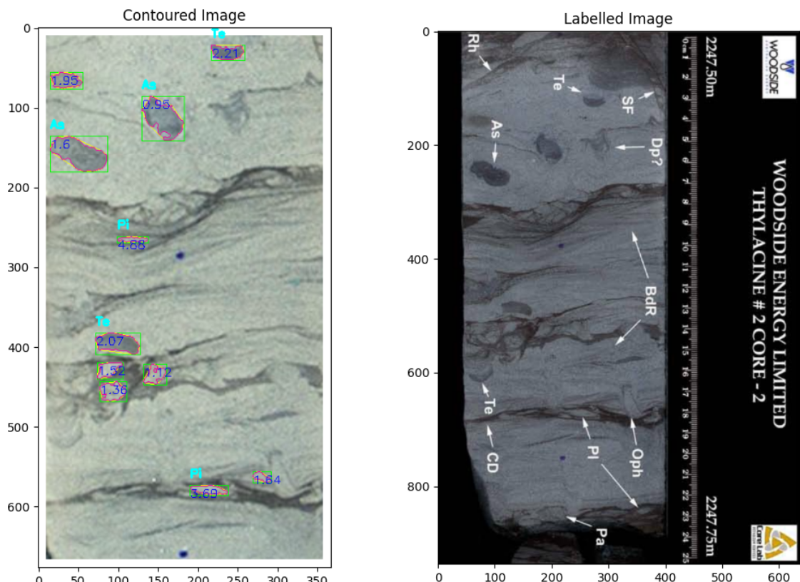

# Core_Photo_Object_Detection

This repository demonstrates simple python code for detecting shapes in imagery.  In the example shown in 'code/ichno_detection.ipynb', trace fossils are detected and classified in drill core photography from an offshore oil & gas well.  

The data for this notebook was obtained from the Thylacine-2 Well Completion Report downloaded for free from the Australian government oil & gas data repository at https://www.ga.gov.au/nopims

The results of object contouring and classification are shown below:

